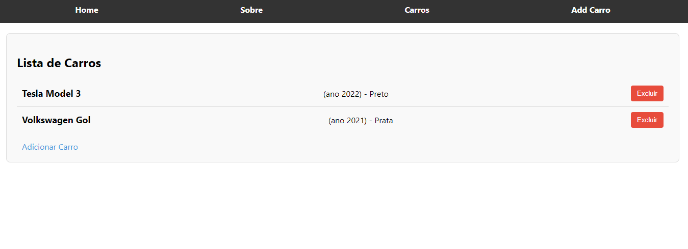

# HotWheels CRUD Project

Este é um projeto de CRUD (Create, Read, Update, Delete) desenvolvido com React. O objetivo principal é permitir que o usuário adicione, visualize e exclua informações de carros.

## Preview

## Requisitos para rodar o projeto

1. Certifique-se de que o Node.js está instalado na sua máquina. Caso não esteja, você pode baixá-lo [aqui](https://nodejs.org/).
2. Clone este repositório.
3. Navegue até o diretório raiz do projeto.
4. Execute o comando `npm install` para instalar todas as dependências.
5. Após as dependências serem instaladas, execute `npm start` para rodar a aplicação localmente.
6. Abra `http://localhost:3000` no seu navegador.

## Estrutura dos Componentes

### 1. **App.js**
   - É o ponto de entrada principal do projeto. Ele configura o roteamento da aplicação utilizando `react-router-dom`. O `NavBar` é exibido em todas as páginas, enquanto cada rota exibe um componente diferente, como `Home`, `About`, `CarList`, `CarForm`, e `NotFound`.

### 2. **NavBar**
   - Componente responsável por renderizar a barra de navegação. Ele contém links para as páginas Home, About, Cars e Add Car. Ele facilita a navegação dentro da aplicação.

### 3. **Home**
   - Componente simples que exibe uma mensagem de boas-vindas ao usuário. Ele é acessado através da rota `/`.

### 4. **About**
   - Página de introdução sobre o projeto. Explica a finalidade e escopo da aplicação. Ele é acessado através da rota `/about`.

### 5. **CarList**
   - Este componente exibe a lista de carros adicionados. Cada carro é mostrado com suas informações básicas e um botão para excluí-lo da lista. Ele está localizado na rota `/cars`.

### 6. **CarForm**
   - Um formulário que permite ao usuário adicionar um novo carro. O formulário coleta informações como marca, modelo, ano, cor e uma descrição. Ele também inclui um botão de excluir ao lado do botão de adicionar carro. Ele está acessível na rota `/add-car`.

### 7. **NotFound**
   - Componente simples exibido quando o usuário acessa uma rota não existente.

## Decisões de Desenvolvimento

1. **Componentização**: A aplicação foi estruturada em pequenos componentes para manter a modularidade e facilitar a manutenção e expansão.
2. **Roteamento**: A navegação entre as páginas foi implementada usando `react-router-dom` para garantir uma experiência de página única (SPA).
3. **Gerenciamento de Estado**: O estado dos carros é mantido localmente no componente `App.js` e passado como props para os componentes `CarList` e `CarForm`, de modo a centralizar o estado da aplicação.
4. **Estilização**: O projeto usa CSS Modules para cada componente, garantindo que os estilos sejam encapsulados, evitando conflitos globais.

